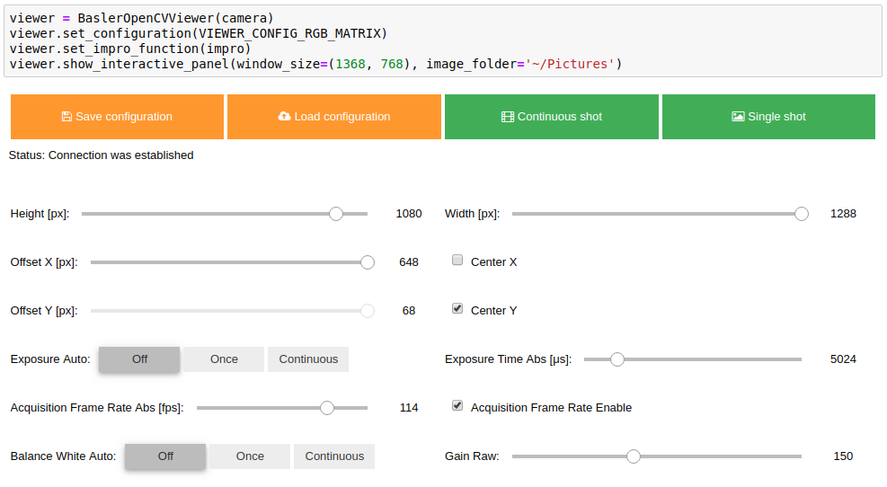
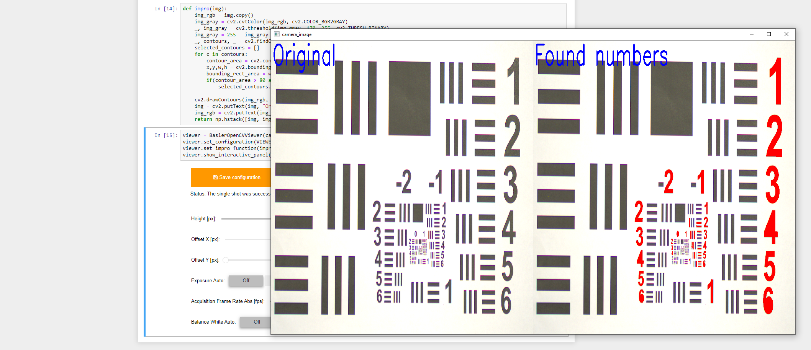

# Basler PyPylon OpenCV viewer for Jupyter Notebook

[](https://badge.fury.io/py/pypylon-opencv-viewer)
[](https://pepy.tech/project/pypylon-opencv-viewer)
[](https://opensource.org/licenses/MIT)

Easy to use Jupyter notebook viewer connecting Basler Pylon images grabbing with OpenCV image processing.
Allows to specify interactive Jupyter widgets to manipulate Basler camera features values, grab camera image and at
once get an OpenCV window on which raw camera output is displayed or you can specify an image processing function,
which takes on the input raw camera output image and display your own output.

## Installation

```bash
pip install pypylon-opencv-viewer
```

## Initialization

To start working, launch Jupyter notebook and connect to Basler camera. Here is an example how we can do it:
```python
from pypylon import pylon 

# Pypylon get camera by serial number
serial_number = '22716154'
info = None
for i in pylon.TlFactory.GetInstance().EnumerateDevices():
    if i.GetSerialNumber() == serial_number:
        info = i
        break
else:
    print('Camera with {} serial number not found'.format(serial_number))

# VERY IMPORTANT STEP! To use Basler PyPylon OpenCV viewer you have to call .Open() method on you camera
if info is not None:
    camera = pylon.InstantCamera(pylon.TlFactory.GetInstance().CreateDevice(info))
    camera.Open()
```
When our camera is connected and open, we can initialize our viewer with it:

```python
from pypylon_opencv_viewer import BaslerOpenCVViewer
viewer = BaslerOpenCVViewer(camera)
```

### Configuration
Next step is to configure created viewer using method `set_configuration`, where passed value is dictionary with the following items: 

    features : list of dicts (required)
        List of widgets configuration stored in
        dictionaries with items:
            name : str (required)
                Camera pylon feature name, example: "GainRaw"
            type : str (required)
                widget input type, allowed values are {"int", "float", "bool", "int_text", "float_text", "choice_text"}
            value : number or bool (optional, default: current camera feature value)
                widget input value
            max : number (optional, default: camera feature max value)
                maximum widget input value, only numeric widget types
            min : number (optional, default: camera feature min value)
                minimum widget input value, only numeric widget types
            step : number (optional, default: camera feature increment)
                step of allowed input value
            options: list, mandatory for type "choice_text",
                sets values in list as options for ToggleButtons
            unit: str (optional, default empty)
                string shown at the end of label in the form "Label [unit]:"
            dependency: dict, (optional, default empty)
                defines how other widgets must be set to be this widget enabled
            layout : dict (optional, default: {"width": '100%', "height": '50px', "align_items": "center"})
                values are passed to widget's layout
            style: dict, (optional, default {'description_width': 'initial'})
                values are passed to widget's style 

        Example:
        "features": {
            "name": "GainRaw",
            "type": "int",
            "value": 20,
            "max": 63,
            "min": 10,
            "step": 1,
            "layout": {"width":"99%", "height": "50px") 
                    "style": {"button_width": "90px"}
            }
    features_layout: list of tuples (optional, default is one widget per row)
        List of features' widgets' name for reordering. Each tuple represents one row
        Example:
            "* features_layout": [
                ("Height", "Width"), 
                ("OffsetX", "CenterX"),     
                ("ExposureAuto", "ExposureTimeAbs"),
                ("AcquisitionFrameCount", "AcquisitionLineRateAbs")
            ],
    actions_layout: list of tuples (optional, default is one widget per row)
        List of actions' widgets' name for reordering. Each tuple represents one row.
        Available widgets are StatusLabel, SaveConfig, LoadConfig, ContinuousShot, SingleShot, "UserSet"
        * Example: 
            "action_layout": [
                ("StatusLabel"), 
                ("SaveConfig", "LoadConfig", "ContinuousShot", "SingleShot"), 
                ("UserSet")
            ]
    default_user_set: string (optional, default is None)
        If value is None, widget for selecting UserSet is displayed. 
        Otherwise is set to given value in ["UserSet1", "UserSet2", "UserSet3"] 
        * Example: 
            "default_user_set": "UserSet3"

The only required and also most important item in the dictionary above is a list of features you want to control. Their names can be found in [official Basler documentation](https://docs.baslerweb.com/#t=en%2Ffeatures.htm&rhsearch=sdk). 

Example configuration you can see below:

```python
# Example of configuration for basic RGB camera's features
VIEWER_CONFIG_RGB_MATRIX = {
    "features": [
        {
            "name": "GainRaw",
            "type": "int",
            "step": 1,
        },
        {
            "name": "Height",
            "type": "int",
            "value": 1080,
            "unit": "px",
            "step": 2,
        },
        {
            "name": "Width",
            "type": "int",
            "value": 1920,
            "unit": "px",
            "step": 2,
        },
        {
            "name": "CenterX",
            "type": "bool",
        },
        {
            "name": "CenterY",
            "type": "bool",

        },
        {
            "name": "OffsetX",
            "type": "int",
            "dependency": {"CenterX": False},
            "unit": "px",
            "step": 2,
        },
        {
            "name": "OffsetY",
            "type": "int",
            "dependency": {"CenterY": False},
            "unit": "px",
            "step": 2,
        },
        {
            "name": "AcquisitionFrameRateAbs",
            "type": "int",
            "unit": "fps",
            "dependency": {"AcquisitionFrameRateEnable": True},
            "max": 150,
            "min": 1,
        },
        {
            "name": "AcquisitionFrameRateEnable",
            "type": "bool",
        },
        {
            "name": "ExposureAuto",
            "type": "choice_text",
            "options": ["Off", "Once", "Continuous"],
            "style": {"button_width": "90px"}
        },
        {
            "name": "ExposureTimeAbs",
            "type": "int",
            "dependency": {"ExposureAuto": "Off"},
            "unit": "μs",
            "step": 100,
            "max": 35000,
            "min": 500,
        },
        {
            "name": "BalanceWhiteAuto",
            "type": "choice_text",
            "options": ["Off", "Once", "Continuous"],
            "style": {"button_width": "90px"}
        },
    ],
    "features_layout": [
        ("Height", "Width"), 
        ("OffsetX", "CenterX"), 
        ("OffsetY", "CenterY"), 
        ("ExposureAuto", "ExposureTimeAbs"),
        ("AcquisitionFrameRateAbs", "AcquisitionFrameRateEnable"),
        ("BalanceWhiteAuto", "GainRaw")
    ],
    "actions_layout": [
        ("StatusLabel"),
        ("SaveConfig", "LoadConfig", "ContinuousShot", "SingleShot"), 
        ("UserSet")
    ],
    "default_user_set": "UserSet3",
}
viewer.set_configuration(VIEWER_CONFIG_RGB_MATRIX)

```


#### Image processing function
We can also define image processing function that we want to apply on grabbed images using method `set_impro_function`. If we don't specify one, we will get raw camera output.

The given function must either return processed image:
```python
def impro(img):
   return np.hstack([img, (255-img)])
viewer.set_impro_function(impro)
```
or display it using cv2.namedWindow. In this case we must specify `own_window=True` to disable showing of default window.
```python
def impro(img):
    cv2.namedWindow('1', cv2.WINDOW_NORMAL | cv2.WINDOW_GUI_NORMAL)
    cv2.resizeWindow('1', 1080, 720)
    cv2.imshow("1", np.hstack([img, (255-img)]))
viewer.set_impro_function(impro, own_window=True)
```
In both cases, DON'T DESTROY ALL OpenCV windows or wait for key pressed in it!

#### Viewer
We have already created our viewer and set its configuration. Now we can display defined widgets using method `show_interactive_panel`
with parameters `image_folder` and `window_size`.
The panel contains 4 buttons:
1. Save configuration - save current values of features to camera's inner memory (UserSet)
1. Load configuration - load values of features from camera's inner memory (UserSet) to the widgets
1. Continuous shot - start streaming frames from the camera
1. Single shot - grab a one frame

Also we can press 's' key to save raw camera image or impro function return value (but only when own_window=False) to `image_folder`.
To close OpenCV windows just push 'q' on the keyboard. We don't have to launch this cell once more to try the same 
procedure with the image, just change wanted values and push the button. That's it!

For configuration above we should see this interactive panel:


#### Example
We can use our viewer along with more complex image processing function for detection of numbers:  
```python
def impro(img):
    img_rgb = img.copy()
    img_gray = cv2.cvtColor(img_rgb, cv2.COLOR_BGR2GRAY)
    _, img_gray = cv2.threshold(img_gray, 170, 255, cv2.THRESH_BINARY)
    img_gray = 255 - img_gray
    _, contours, _ = cv2.findContours(img_gray, cv2.RETR_EXTERNAL, cv2.CHAIN_APPROX_SIMPLE)
    selected_contours = []
    for c in contours:
        contour_area = cv2.contourArea(c)
        x,y,w,h = cv2.boundingRect(c)        
        bounding_rect_area = w*h
        if(contour_area > 80 and contour_area/bounding_rect_area < 0.75):
            selected_contours.append(c)

    cv2.drawContours(img_rgb, selected_contours, -1, (0,0,255), thickness=cv2.FILLED)    
    img = cv2.putText(img, "Original", (10, 100), cv2.FONT_HERSHEY_SIMPLEX, 4, (255,0,0), 8)
    img_rgb = cv2.putText(img_rgb, "Found numbers", (10, 100), cv2.FONT_HERSHEY_SIMPLEX, 4, (255,0,0), 8)
    return np.hstack([img, img_rgb])
```


#### Save or get image from camera

In previous steps we set up camera features parameters using widgets. Now we can save camera image on disc or get 
raw openCV image (impro function return value if specified).

```python
# Save image
viewer.save_image('~/Documents/images/grabbed.png')

# Get grabbed image
img = viewer.get_image()
```
